# Arquitetura Unleash: Como Evito o Gargalo de Rede nas Feature Flags

O principal receio que o time de desenvolvimento levantou em relação à adoção do Unleash é legítimo: **fazer requisições HTTP adicionais por requisição da API (rede externa) é um anti-padrão de performance que geraria um gargalo significativo.**

No entanto, o **Unleash não funciona dessa forma**. Explico abaixo o funcionamento interno do SDK do Unleash, como ele resolve esse problema arquitetural e apresento dados reais que medi na minha POC para demonstrar a viabilidade do sistema.

---

## 1. Funcionamento Arquitetural: Avaliação Local (In-Memory)

Os SDKs oficiais do Unleash (Node.js, Java, Spring Boot, .NET, Go, etc.) foram projetados especificamente para evitar chamadas de rede no caminho crítico das requisições (request path).

```mermaid
sequenceDiagram
    participant App as Minha Aplicação (API)
    participant SDK as SDK do Unleash (In-Memory)
    participant Serv as Unleash Server
    
    Note over SDK,Serv: Sincronização em Background (Assíncrona)
    loop A cada 15 segundos (Padrão)
        SDK->>Serv: GET /api/client/features (Baixa novas regras)
        Serv-->>SDK: JSON com definições e regras das flags
        Note over SDK: Atualiza cache local em memória
    end

    Note over App,SDK: Caminho Crítico da Requisição do Usuário
    rect rgb(30, 45, 55)
        App->>SDK: unleash.isEnabled('minha_flag', context)
        Note over SDK: Avaliação local das regras de ativação<br/>(Sem acesso à rede)
        SDK-->>App: true / false (Retorno instantâneo)
    end
```

### Detalhes Técnicos:
1. **Sincronização em Segundo Plano (Background Polling):** Ao inicializar o SDK na aplicação (`unleash.initialize(...)`), ele inicia uma rotina assíncrona que busca o estado e as regras de todas as feature flags do Unleash Server periodicamente (por padrão, a cada 15 segundos).
2. **Armazenamento em Memória (Local Cache):** A definição de todas as regras é mantida em memória local na aplicação.
3. **Avaliação Sem Rede:** A função `unleash.isEnabled('flag_name', context)` faz apenas operações lógicas/matemáticas locais usando os dados na memória (ex.: hashing para porcentagem de rollout, validação de regras de segmento). **Zero tráfego de rede é gerado por requisição.**
4. **Envio de Métricas Assíncrono:** O SDK acumula os resultados das avaliações (ex.: quantas vezes deu `true` e `false`) e envia esse relatório de métricas em lotes de forma assíncrona (geralmente a cada 60 segundos), sem bloquear nenhuma requisição do usuário.

---

## 2. Resiliência e Tolerância a Falhas

Como a avaliação é feita em memória local:
* **Se o servidor do Unleash cair:** A aplicação continua avaliando as flags normalmente com o último estado baixado do cache. Não há impacto de indisponibilidade ou lentidão para o usuário final.
* **Fallback no Bootstrap:** Caso o Unleash esteja fora do ar no exato momento do boot da aplicação, o SDK aceita um arquivo de backup local (`bootstrap`) ou assume valores padrão de fallback definidos em código.

---

## 3. Comparativo de Tráfego de Rede e Volume de Chamadas (Com vs Sem SDK)

Para deixar claro o ganho operacional e de performance, montei uma tabela comparativa simulando uma única instância de microsserviço operando com uma carga moderada de **100 RPS** (Requisições por Segundo), onde cada requisição de negócio avalia **3 feature flags**:

| Métrica / Cenário | Sem o SDK (HTTP direto por flag check) | Com o SDK do Unleash (In-Memory) | Redução de Impacto / Ganho |
| :--- | :--- | :--- | :--- |
| **Chamadas de Rede por Segundo** | 300 req/s | ~0.06 req/s | **99.98% menos requisições** |
| **Chamadas de Rede por Minuto** | 18.000 req/min | 5 req/min (4 de sync + 1 de métricas) | **99.97% de economia** |
| **Chamadas de Rede por Dia** | 25.920.000 req/dia | 7.200 req/dia | **~25.9 milhões de requisições a menos** |
| **Latência Adicionada à Transação** | +15 ms a +50 ms (tempo de rede/TLS) | **~0 ms** (instantâneo em memória) | **Latência zero para o cooperado** |
| **Dependência / Risco de Queda** | Se o Unleash Server cair, a API degrada | Se o Unleash Server cair, a API continua rodando | **Resiliência total a falhas** |
| **Custo de Infraestrutura (Unleash)** | Altíssimo (exige CPU/banco para milhões de reqs) | Irrisório (servidor Unleash processa poucas chamadas) | **Infraestrutura muito mais enxuta** |

### Evidência em Tempo Real na Minha POC:
Para tornar essa diferença visual e inquestionável, adicionei o painel **"4. Telemetria de Rede (Tempo Real)"** na interface da minha POC. Ele monitora:
1. O número total de avaliações lógicas de flags que executei (que corresponderiam ao número de HTTP requests necessários **Sem o SDK**).
2. O número real de requisições HTTP feitas pela aplicação ao servidor Unleash (**Com o SDK**).

Após simular **3.000 avaliações de cooperados**, a POC registrou:
* **Sem SDK (HTTP p/ flag):** **3.177** chamadas de rede que teriam sido efetuadas.
* **Com SDK (In-Memory):** Apenas **74** chamadas de rede reais efetuadas (soma do bootstrap, polling periódico de background e cliques de administração).
* **Economia real de rede:** **3.103 requisições** evitadas, o que poupou cerca de **62,06 segundos** de tempo de rede acumulado (estimando ~20ms de tempo de handshake/transmissão por chamada HTTP).

---

## 4. Prova Prática: Métricas da Minha POC

Para comprovar a viabilidade e obter argumentos empíricos sobre a performance, adicionei telemetria e instrumentação de tempo real na minha aplicação demo (`demo-app`).

Executei testes e registrei os resultados reais de latência gerados pelo SDK do Unleash:

* **Latência de Avaliação Unitária (1 usuário padrão/VIP):**
  * Tempo medido: **~0.100 ms a 0.250 ms** (100 a 250 microssegundos).
  * *Comparativo:* Uma chamada de banco de dados leva cerca de 2 ms a 15 ms. Uma chamada HTTP externa no mesmo data center leva no mínimo 1 ms a 5 ms. Avaliar a flag localmente consome frações insignificantes de processamento de CPU.
* **Teste de Estresse de Rollout (Avaliar 1.000 usuários em loop sequencial):**
  * Tempo total medido: **~10.88 ms** para rodar todas as 1.000 validações.
  * Média de latência: **~10.88 µs (microssegundos)** por verificação de flag!
  * *Conclusão:* Se cada verificação fizesse uma requisição HTTP, rodar 1.000 requisições sequenciais levaria no mínimo **10 a 30 segundos**, enquanto o processamento local consumiu apenas **10 milissegundos**.

---

## 5. Prova Prática: Consumo de Memória do SDK

O outro ponto de preocupação comum é o consumo de memória ao manter o cache de feature flags localmente na aplicação. Para comprovar o impacto irrisório, adicionei um endpoint de diagnóstico (`/api/diagnostics`) que calcula o consumo real:

* **Quantidade de Flags em Cache:** 3 flags
* **Tamanho do Payload Serializado (JSON):** **1.04 KB**
* **Uso no V8 Heap (Objetos JS instanciados):** **~4.16 KB** (estimando um overhead de 4x para o motor de execução JavaScript)
* **Heap Total Utilizado pelo Node.js:** **14.03 MB**

### O que isso representa em produção?
Mesmo se escalarmos o projeto para **1.000 feature flags ativas**, o payload serializado seria de apenas **~350 KB a 500 KB**. O consumo total em memória do SDK seria em torno de **1.5 MB a 2 MB**. Em containers de produção que costumam rodar com limites normais de 512 MB ou 1 GB de RAM, o impacto do cache local do Unleash é **completamente irrelevante**.

---

## 6. Resumo dos Argumentos que Levarei ao Time

Reuni estes seis tópicos principais para apresentar ao time de engenharia e mitigar a preocupação:

1. **A avaliação é 100% local:** O `unleash.isEnabled()` é uma função puramente lógica e síncrona em memória. Ela não gera conexões HTTP ao Unleash a cada chamada.
2. **Impacto de rede é zero no request path:** A sincronização das flags e o envio de métricas ocorrem de forma 100% assíncrona, em threads/loops de segundo plano no SDK.
3. **Resiliência robusta:** A API não depende da disponibilidade em tempo real do servidor do Unleash para processar transações.
4. **Performance comprovada:** Nos meus testes práticos na POC, a média foi de **~10 microssegundos** por avaliação de flag, provando que a preocupação sobre gargalo de performance não se sustenta tecnicamente.
5. **Memória irrisória:** O consumo de RAM para armazenar as flags e suas regras é de apenas alguns **Kilobytes** por instância de aplicação.
6. **Desafogo de Rede:** Utilizar o SDK evita milhões de requisições desnecessárias que entupiriam os sockets de rede e sobrecarregariam o servidor do Unleash.
